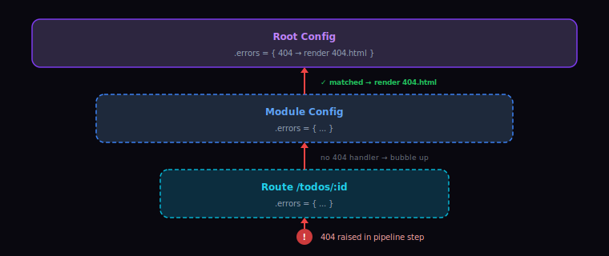
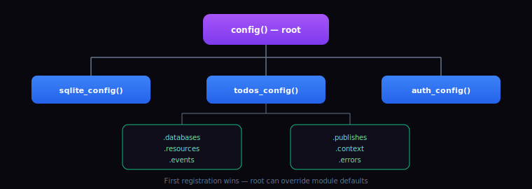
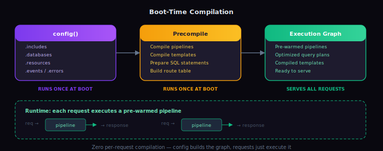
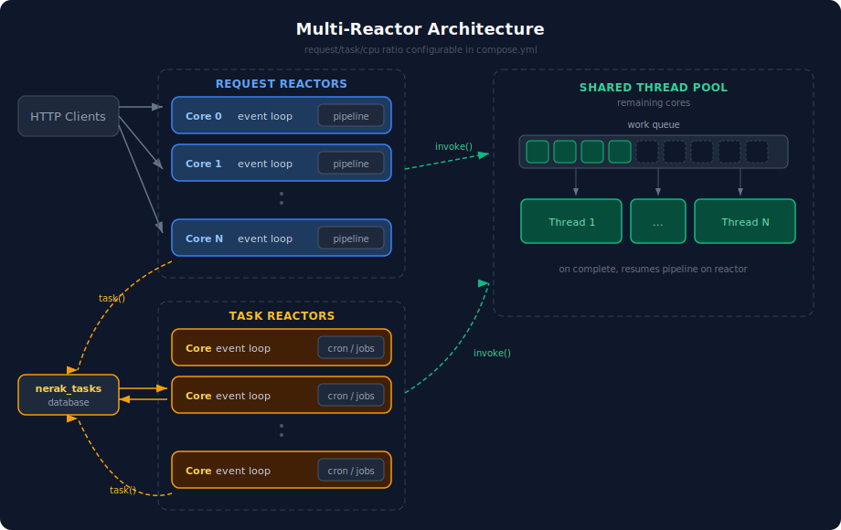

## Why Nerak

Nerak is a declarative framework for building asynchronous web applications in C23.

* **No build configuration.** Compilation, hot code reloading, and HMR are handled by the framework. No build scripts, package managers, or ORMs. SQL and HTML assets are discovered automatically.
* **Memory, concurrency, and I/O managed by the framework.** Application code does not call `malloc`/`free` or manage threads, mutexes, or locks. Queries run as prepared statements. Pipeline steps emit OpenTelemetry spans, logs, and errors automatically.
* **Durable tasks and events.** Both are persisted. After a crash, incomplete tasks resume at the step where they stopped and undelivered events replay on the next boot.
* **Bundled modules.** Datastar, HTMX, Tailwind, DaisyUI, SQLite, Postgres, MySQL, Redis/Valkey, DuckDB, and auth. Multi-tenant database support is built in.

---

## Table of Contents
* [Quick Start](#quick-start)
* [Philosophy](#philosophy)
* [Guide](#guide)
* [Reference](#reference)
* [Architecture](#architecture)
* [Tooling](#tooling)
* [Built With](#built-with)
* [License](#license)

---

## Quick Start

Everything runs in Docker. No other local dependencies.

```bash
mkdir myapp && cd myapp
wget https://docker.nightshadecoder.dev/nerak/compose.yml

# Dev server on :3000, telemetry on :4000
# Includes file watching, auto compilation, hot code reloading, HMR
docker compose up
```

Create `main.c` with the example below. Nerak watches for changes and hot-reloads on save. Use your own editor, or attach to the built-in TUI with `docker compose attach nerak` for an integrated editor, AI, LSP, and console.

```c
#include <nerak.h>

config(main){
  context("hello", "<h1>Hello, world!</h1>");
  resource("home", "/", .get = {respond("hello")});
}
```

`config(main)` runs once at boot and declares the application. `context()` registers a named template inline; `resource()` declares the `home` endpoint mapping `/` to a GET pipeline that renders that template. See the [Guide](#guide) for a step-by-step walkthrough.

---

## Philosophy

An application is a data transformation: input arrives, gets transformed, leaves as output.

All assets and tooling are standard: raw SQL, JSON, Markdown, and HTML/CSS/JS via Mustache templates, business logic is plain C, lldb for debugging, Playwright and Criterion for testing, OpenTelemetry for observability, OpenCode for AI. Nerak arranges these into pipelines: ordered lists of steps that turn a request into a response.

### Everything is a String

The web is text: HTTP, HTML, JSON, SQL. The pipeline context stores and passes data as strings. There is no intermediate parsing or serialization layer. Strings are interpolated into SQL, templates, and URLs with `{{context_key}}`.

### CLAD

Four principles:

* **(C)omposable:** small, independent steps chain into feature pipelines.
* **(L)ocality of Behavior:** behavior is apparent from reading the code. SQL, templates, and logic for a feature live together, not spread across model, view, and controller trees.
* **(A)utonomous:** modules are self-contained: own schemas, migrations, seeds, routes, UI, and logic. The compiler enforces boundaries.
* **(D)omain Based:** each module owns one slice of the app. A `todos` module defines everything related to todos and nothing else.

Influenced by:

* [Data Oriented Design](https://youtu.be/rX0ItVEVjHc)
* [A Philosophy of Software Design](https://youtu.be/bmSAYlu0NcY)
* [CUPID](https://youtu.be/cyZDLjLuQ9g)
* [Self-Contained Systems](https://youtu.be/Jjrencq8sUQ)
* [Locality of Behavior](https://htmx.org/essays/locality-of-behaviour)

---

## Guide

Builds a todo app one concept at a time. See the [Reference](#reference) for full options on each step, helper, and field. Nerak discovers assets automatically and seeds each into the context of the module that owns it, based on file location (see [Assets](#assets)).

* [1. Pages and Templates](#1-pages-and-templates)
* [2. Show Data](#2-show-data)
* [3. Accept Input](#3-accept-input)
* [4. Nested Data](#4-nested-data)
* [5. Calling APIs](#5-calling-apis)
* [6. Tasks](#6-tasks)
* [7. Modules and Events](#7-modules-and-events)

### 1. Pages and Templates

Each `resource(...)` declares a named URL endpoint; each verb pipeline is a list of steps. `mustache("home", "home_s")` renders the template asset `home` into context key `home_s`, and `respond("home_s")` sends it. Reference resources by name with `{{url:...}}`.

Both pages share a layout, so `home` doubles as the layout: it declares the nav and a `{{$body}}` block whose default is the welcome page. The `todos` page extends it with `{{< home}}...{{/home}}`, overriding that block. Any template that declares a `{{$block}}` can be a parent; there is no special layout type.

**`home.html`**
```html
<html>
  <body>
    <nav><a href='{{url:home}}'>Home</a> · <a href='{{url:todos}}'>My Todos</a></nav>
    <main>
      {{$body}}
        <h1>Welcome</h1>
      {{/body}}
    </main>
  </body>
</html>
```

**`todos.html`**
```html
{{< home}}
  {{$body}}
    <h1>My Todos</h1>
    <p>Nothing yet.</p>
  {{/body}}
{{/home}}
```

**`main.c`**
```c
#include <nerak.h>

config(main){
  resource("home", "/",
    .get = {
      mustache("home", "home_s"),
      respond("home_s")
    }
  );
  resource("todos", "/todos",
    .get = {
      mustache("todos", "todos_s"),
      respond("todos_s")
    }
  );
}
```

See [Resource Pipelines](#resource-pipelines) and [Templates](#templates).

### 2. Show Data

Bring in SQLite with `#include <sqlite.h>`, declare a database with `sqlite_database(...)`, and read with `sqlite_query()`. SQL files are assets like templates: `get_todos.sql` becomes the asset `get_todos`.

Three new SQL files:

**`create_todos_table.sql`**
```sql
CREATE TABLE todos (
  id INTEGER PRIMARY KEY AUTOINCREMENT,
  title TEXT NOT NULL
);
```

**`seed_todos.sql`**
```sql
INSERT INTO todos(title) VALUES('Learn Nerak');
```

**`get_todos.sql`**
```sql
select id, title from todos;
```

Render the rows Nerak stores under `todos_data`:

**`todos.html`**
```diff
 {{< home}}
   {{$body}}
     <h1>My Todos</h1>
-    <p>Nothing yet.</p>
+    <ul>
+      {{#todos_data}}
+        <li>{{title}}</li>
+      {{/todos_data}}
+    </ul>
   {{/body}}
 {{/home}}
```

Wire up the module, database, and query:

**`main.c`**
```diff
 #include <nerak.h>
+#include <sqlite.h>

 config(main){
+  sqlite_database(
+    .name = "todos_db",
+    .connect = "file:todos.db?mode=rwc",
+    .migrations = {"create_todos_table"},
+    .seeds = {"seed_todos"}
+  );
+
   resource("home", "/",
     .get = {
       mustache("home", "home_s"),
       respond("home_s")
     }
   );
   resource("todos", "/todos",
     .get = {
+      sqlite_query({"todos_db", "get_todos", "todos_data"}),
       mustache("todos", "todos_s"),
       respond("todos_s")
     }
   );
 }
```

Query parameters: database name, SQL asset, context key for the result table (`todos_data`). The template walks the result with `{{#todos_data}}...{{/todos_data}}`. Migrations and seeds run on first connection. See [Databases](#databases) and [query](#query).

### 3. Accept Input

Add a `.post` verb that validates, inserts, and redirects (POST-redirect-GET). A resource-scoped `.errors` handler re-renders the form on validation failure.

**`create_todo.sql`**
```sql
insert into todos(title) values({{title}});
```

Add the form, repopulating the field and showing the error after a failed submit:

**`todos.html`**
```diff
 {{< home}}
   {{$body}}
     <h1>My Todos</h1>
     <ul>
       {{#todos_data}}
         <li>{{title}}</li>
       {{/todos_data}}
     </ul>
+    <form method='post' action='{{url:todos}}'>
+      {{csrf:input}}
+      <input name='title' value='{{input:title}}'>
+      {{#error:title}}
+        <span class='error'>{{error_message:title}}</span>
+      {{/error:title}}
+      <button>Add</button>
+    </form>
   {{/body}}
 {{/home}}
```

Add a `.post` verb and an `.errors` handler:

**`main.c`**
```diff
 #include <nerak.h>
 #include <sqlite.h>

 config(main){
   sqlite_database(
     .name = "todos_db",
     .connect = "file:todos.db?mode=rwc",
     .migrations = {"create_todos_table"},
     .seeds = {"seed_todos"}
   );

   resource("home", "/",
     .get = {
       mustache("home", "home_s"),
       respond("home_s")
     }
   );

   resource("todos", "/todos",
     .get = {
       sqlite_query({"todos_db", "get_todos", "todos_data"}),
       mustache("todos", "todos_s"),
       respond("todos_s")
-    }
+    },
+    .post = {
+      input({"title", m_not_empty}),
+      sqlite_query({"todos_db", "create_todo"}),
+      redirect("todos")
+    },
+    .errors = {
+      {m_bad_request, {reroute("todos")}}
+    }
   );
 }
```

`input()` validates and promotes `title` to app scope; the `{{title}}` in `create_todo.sql` binds as a prepared-statement parameter. On failure, `m_bad_request` triggers the handler, which `reroute`s back into the GET pipeline in-process. The `input:` and `error:` scopes survive the reroute, so the form repopulates with `{{input:title}}` and shows `{{error_message:title}}`. See [input](#input), [Error and Repair Pipelines](#error-and-repair-pipelines), and [redirect and reroute](#redirect-and-reroute).

### 4. Nested Data

A `/todos/:id` page fetches a todo and its comments concurrently, then nests the comments inside the todo with `join()`.

Three new SQL files and one new template:

**`create_comments_table.sql`**
```sql
CREATE TABLE comments (
  id INTEGER PRIMARY KEY AUTOINCREMENT,
  todo_id INTEGER NOT NULL REFERENCES todos(id),
  body TEXT NOT NULL
);
```

**`get_todo.sql`**
```sql
select id, title from todos where id = {{id}};
```

**`get_comments.sql`**
```sql
select id, todo_id, body from comments where todo_id = {{id}};
```

Enter `{{#todo_data}}` first; after the join, `comments` lives inside each todo record:

**`todo.html`**
```html
{{< home}}
  {{$body}}
    {{#todo_data}}
      <h1>{{title}}</h1>
      <h2>Comments</h2>
      <ul>
        {{#comments}}
          <li>{{body}}</li>
        {{/comments}}
      </ul>
    {{/todo_data}}
  {{/body}}
{{/home}}
```

Link each list item to its detail page. `{{url:todo}}` resolves to the `todo` resource's pattern (`/todos/:id`) and fills `:id` from the current row, so no argument is needed:

**`todos.html`**
```diff
       {{#todos_data}}
-        <li>{{title}}</li>
+        <li><a href='{{url:todo}}'>{{title}}</a></li>
       {{/todos_data}}
```

Register the migration and add a `todo` resource:

**`main.c`**
```diff
 #include <nerak.h>
 #include <sqlite.h>

 config(main){
   sqlite_database(
     .name = "todos_db",
     .connect = "file:todos.db?mode=rwc",
-    .migrations = {"create_todos_table"},
+    .migrations = {"create_todos_table", "create_comments_table"},
     .seeds = {"seed_todos"}
   );

   resource("home", "/",
     .get = {
       mustache("home", "home_s"),
       respond("home_s")
     }
   );

   resource("todos", "/todos",
     .get = {
       sqlite_query({"todos_db", "get_todos", "todos_data"}),
       mustache("todos", "todos_s"),
       respond("todos_s")
     },
     .post = {
       input({"title", m_not_empty}),
       sqlite_query({"todos_db", "create_todo"}),
       redirect("todos")
     },
     .errors = {
       {m_bad_request, {reroute("todos")}}
     }
   );
+
+  resource("todo", "/todos/:id",
+    .get = {
+      input({"id", m_integer}),
+      sqlite_query(
+        {"todos_db", "get_todo", "todo_data", .must_exist = true},
+        {"todos_db", "get_comments", "comments"}
+      ),
+      join("todo_data", "id", "comments", "todo_id"),
+      mustache("todo", "todo_s"),
+      respond("todo_s")
+    }
+  );
 }
```

Both queries in one `sqlite_query()` call run concurrently. `join()` lifts `comments` inside each `todo_data` record, so the template reaches `{{#comments}}` from within `{{#todo_data}}`. `.must_exist = true` returns 404 when the id matches nothing. See [join](#join) and [query](#query).

### 5. Calling APIs

`fetch()` calls external HTTP services like a query calls a database. JSON parses into context tables; multiple items in one `fetch()` run concurrently.

Show the responses on the home page:

**`home.html`**
```diff
 <html>
   <body>
     <nav><a href='{{url:home}}'>Home</a> · <a href='{{url:todos}}'>My Todos</a></nav>
     <main>
-      {{$body}}
-        <h1>Welcome</h1>
-      {{/body}}
+      {{$body}}
+        <h1>Welcome</h1>
+        {{#weather}}
+          <p>{{city}}: {{precision:temp_c:0}}°C, {{conditions}}</p>
+        {{/weather}}
+        {{#quote}}
+          <blockquote>{{content}}, {{author}}</blockquote>
+        {{/quote}}
+      {{/body}}
     </main>
   </body>
 </html>
```

Fetch both services concurrently before rendering:

**`main.c`**
```diff
 #include <nerak.h>
 #include <sqlite.h>

 config(main){
   sqlite_database(
     .name = "todos_db",
     .connect = "file:todos.db?mode=rwc",
     .migrations = {"create_todos_table", "create_comments_table"},
     .seeds = {"seed_todos"}
   );

   resource("home", "/",
     .get = {
+      fetch(
+        {"https://api.quotes.dev/random", "quote"},
+        {"https://api.weather.dev/now", "weather"}
+      ),
       mustache("home", "home_s"),
       respond("home_s")
     }
   );
```

Both requests run concurrently under one `fetch()` call. The JSON parses into context tables the template walks with `{{#quote}}` and `{{#weather}}`. `fetch()` also supports other verbs, headers, request bodies, and interpolated URLs. See [fetch](#fetch).

### 6. Tasks

A task is a named, reusable pipeline. Define it once with optional `.cron`; dispatch durable background runs with `dispatch_task("name")` (from `dispatch.h`).

Two new SQL files:

**`create_daily_stats_table.sql`**
```sql
CREATE TABLE daily_stats (
  id INTEGER PRIMARY KEY AUTOINCREMENT,
  recorded_at TIMESTAMP DEFAULT CURRENT_TIMESTAMP,
  todo_count INTEGER NOT NULL
);
```

**`record_daily_stats.sql`**
```sql
insert into daily_stats(todo_count) select count(*) from todos;
```

Register the migration, define the tasks, dispatch them from the POST:

**`main.c`**
```diff
 #include <nerak.h>
 #include <sqlite.h>
+#include <dispatch.h>

 config(main){
   sqlite_database(
     .name = "todos_db",
     .connect = "file:todos.db?mode=rwc",
-    .migrations = {"create_todos_table", "create_comments_table"},
+    .migrations = {"create_todos_table", "create_comments_table", "create_daily_stats_table"},
     .seeds = {"seed_todos"}
   );

+  task("record_daily_stats", {
+    sqlite_query({"todos_db", "record_daily_stats"})
+  }, .cron = "0 0 * * *");
+
+  task("notify_new_todo", {
+    fetch({
+      "https://api.push.dev/notify",
+      .method = m_post,
+      .json = "{\"text\":\"New todo: {{title}}\"}"
+    })
+  }, .accepts = {"title"});
+
   resource("home", "/",
     .get = {
       fetch(
         {"https://api.quotes.dev/random", "quote"},
         {"https://api.weather.dev/now", "weather"}
       ),
       mustache("home", "home_s"),
       respond("home_s")
     }
   );

   resource("todos", "/todos",
     .get = {
       sqlite_query({"todos_db", "get_todos", "todos_data"}),
       mustache("todos", "todos_s"),
       respond("todos_s")
     },
     .post = {
       input({"title", m_not_empty}),
       sqlite_query({"todos_db", "create_todo"}),
+      dispatch_task("notify_new_todo"),
       redirect("todos")
     },
     .errors = {
       {m_bad_request, {reroute("todos")}}
     }
   );

   resource("todo", "/todos/:id",
     .get = {
       input({"id", m_integer}),
       sqlite_query(
         {"todos_db", "get_todo", "todo_data", .must_exist = true},
         {"todos_db", "get_comments", "comments"}
       ),
       join("todo_data", "id", "comments", "todo_id"),
       mustache("todo", "todo_s"),
       respond("todo_s")
     }
   );
 }
```

`.cron` and `dispatch_task(...)` both run the task on a task reactor, off the request reactors, so the POST returns immediately. Dispatched tasks are durable: a crash mid-task resumes on the next boot. To hand values to a task, list them under `.accepts`; `notify_new_todo` pulls in `title` that way. `dispatch_task()` comes from `dispatch.h`. See [Task Pipelines](#task-pipelines).

### 7. Modules and Events

Split features into modules that talk through pub/sub events. A module is a folder with a matching `.c` file (`todos/todos.c`) declaring `config(todos){ ... }`, which registers the module's resources, databases, tasks, and subscribers. Assets in the folder belong to the module. `main.c` composes modules by `#include`ing each `.c` file; the include is all that is needed.

This step moves todos into its own module and adds an `activity` module that records an entry whenever a todo is created. Move the todos assets into `todos/`, add the new `activity/` folder, leave `home` (the shared layout) at the root:

```
.
├── todos/
│   ├── todos.c
│   ├── todos.html
│   ├── todo.html
│   ├── create_todos_table.sql
│   ├── seed_todos.sql
│   ├── get_todos.sql
│   ├── get_todo.sql
│   ├── get_comments.sql
│   └── create_todo.sql
├── activity/
│   ├── activity.c
│   ├── activity.html
│   ├── create_activity_table.sql
│   ├── get_activities.sql
│   └── insert_activity.sql
├── home.html
└── main.c
```

`main.c` collapses to a thin composer:

**`main.c`**
```diff
 #include <nerak.h>
-#include <sqlite.h>
-#include <dispatch.h>
+#include "todos/todos.c"
+#include "activity/activity.c"

 config(main){
-  sqlite_database(
-    .name = "todos_db",
-    .connect = "file:todos.db?mode=rwc",
-    .migrations = {"create_todos_table", "create_comments_table", "create_daily_stats_table"},
-    .seeds = {"seed_todos"}
-  );
-
-  task("record_daily_stats", {
-    sqlite_query({"todos_db", "record_daily_stats"})
-  }, .cron = "0 0 * * *");
-
-  task("notify_new_todo", {
-    fetch({
-      "https://api.push.dev/notify",
-      .method = m_post,
-      .json = "{\"text\":\"New todo: {{title}}\"}"
-    })
-  }, .accepts = {"title"});
-
   resource("home", "/",
     .get = {
       fetch(
         {"https://api.quotes.dev/random", "quote"},
         {"https://api.weather.dev/now", "weather"}
       ),
       mustache("home", "home_s"),
       respond("home_s")
     }
   );
-
-  resource("todos", "/todos",
-    .get = {
-      sqlite_query({"todos_db", "get_todos", "todos_data"}),
-      mustache("todos", "todos_s"),
-      respond("todos_s")
-    },
-    .post = {
-      input({"title", m_not_empty}),
-      sqlite_query({"todos_db", "create_todo"}),
-      dispatch_task("notify_new_todo"),
-      redirect("todos")
-    },
-    .errors = {
-      {m_bad_request, {reroute("todos")}}
-    }
-  );
-
-  resource("todo", "/todos/:id",
-    .get = {
-      input({"id", m_integer}),
-      sqlite_query(
-        {"todos_db", "get_todo", "todo_data", .must_exist = true},
-        {"todos_db", "get_comments", "comments"}
-      ),
-      join("todo_data", "id", "comments", "todo_id"),
-      mustache("todo", "todo_s"),
-      respond("todo_s")
-    }
-  );
 }
```

Add an Activity link to the shared nav:

**`home.html`**
```diff
 <html>
   <body>
-    <nav><a href='{{url:home}}'>Home</a> · <a href='{{url:todos}}'>My Todos</a></nav>
+    <nav><a href='{{url:home}}'>Home</a> · <a href='{{url:todos}}'>My Todos</a> · <a href='{{url:activity}}'>Activity</a></nav>
     <main>
       {{$body}}
         <h1>Welcome</h1>
         {{#weather}}
           <p>{{city}}: {{precision:temp_c:0}}°C, {{conditions}}</p>
         {{/weather}}
         {{#quote}}
           <blockquote>{{content}}, {{author}}</blockquote>
         {{/quote}}
       {{/body}}
     </main>
   </body>
 </html>
```

The todos logic moves into the module unchanged, gaining a `publish()` and an `emit()` step. Both todo resources come along:

**`todos/todos.c`**
```c
#include <nerak.h>
#include <sqlite.h>
#include <pubsub.h>
#include <dispatch.h>

config(todos){
  sqlite_database(
    .name = "todos_db",
    .connect = "file:todos.db?mode=rwc",
    .migrations = {"create_todos_table", "create_comments_table", "create_daily_stats_table"},
    .seeds = {"seed_todos"}
  );

  publish("todo_created",
    .with = {"title"}
  );

  task("record_daily_stats", {
    sqlite_query({"todos_db", "record_daily_stats"})
  }, .cron = "0 0 * * *");

  task("notify_new_todo", {
    fetch({
      "https://api.push.dev/notify",
      .method = m_post,
      .json = "{\"text\":\"New todo: {{title}}\"}"
    })
  }, .accepts = {"title"});

  resource("todos", "/todos",
    .get = {
      sqlite_query({"todos_db", "get_todos", "todos_data"}),
      mustache("todos", "todos_s"),
      respond("todos_s")
    },
    .post = {
      input({"title", m_not_empty}),
      sqlite_query({"todos_db", "create_todo"}),
      dispatch_task("notify_new_todo"),
      emit("todo_created"),
      redirect("todos")
    },
    .errors = {
      {m_bad_request, {reroute("todos")}}
    }
  );

  resource("todo", "/todos/:id",
    .get = {
      input({"id", m_integer}),
      sqlite_query(
        {"todos_db", "get_todo", "todo_data", .must_exist = true},
        {"todos_db", "get_comments", "comments"}
      ),
      join("todo_data", "id", "comments", "todo_id"),
      mustache("todo", "todo_s"),
      respond("todo_s")
    }
  );
}
```

The `activity` module owns its own table, query, template, and subscriber. Nothing in it references the todos module:

**`activity/create_activity_table.sql`**
```sql
CREATE TABLE activities (
  id INTEGER PRIMARY KEY AUTOINCREMENT,
  kind TEXT NOT NULL,
  ref TEXT NOT NULL,
  created_at TIMESTAMP DEFAULT CURRENT_TIMESTAMP
);
```

**`activity/insert_activity.sql`**
```sql
insert into activities(kind, ref) values('created', {{title}});
```

**`activity/get_activities.sql`**
```sql
select kind, ref, created_at from activities order by created_at desc;
```

**`activity/activity.html`**
```html
{{< home}}
  {{$body}}
    <h1>Activity</h1>
    <ul>
      {{#activities}}
        <li>{{kind}}: {{ref}} ({{created_at}})</li>
      {{/activities}}
    </ul>
  {{/body}}
{{/home}}
```

**`activity/activity.c`**
```c
#include <nerak.h>
#include <sqlite.h>
#include <pubsub.h>

config(activity){
  sqlite_database(
    .name = "activity_db",
    .connect = "file:activity.db?mode=rwc",
    .migrations = {"create_activity_table"}
  );

  subscribe("todo_created", {
    sqlite_query({"activity_db", "insert_activity"})
  });

  resource("activity", "/activity",
    .get = {
      sqlite_query({"activity_db", "get_activities", "activities"}),
      mustache("activity", "activity_s"),
      respond("activity_s")
    }
  );
}
```

When the POST calls `emit("todo_created")`, Nerak propagates the keys named in `publish(...).with` (`title`) to every subscriber. The `activity` module writes its row with no direct link to the publisher. Events are durable: undelivered ones replay after a crash. Adding a third subscriber is a new file with its own `subscribe(...)`; the publisher does not change. See [Modules and Composition](#modules-and-composition) and [Event Pipelines](#event-pipelines).

---
## Reference

* [Context](#context)
* [Templates](#templates)
* [Assets](#assets)
* [Databases](#databases)
* [Resource Pipelines](#resource-pipelines)
* [Error and Repair Pipelines](#error-and-repair-pipelines)
* [Event Pipelines](#event-pipelines)
* [Task Pipelines](#task-pipelines)
* [Pipeline Steps](#pipeline-steps)
* [Imperative API](#imperative-api)
* [Conditionals](#conditionals)
* [Iteration](#iteration)
* [Modules and Composition](#modules-and-composition)
* [Additional Modules](#additional-modules)
* [Static Files](#static-files)
* [External Dependencies](#external-dependencies)

### Context

Pipelines read from and write to a shared, scoped key-value store that lives for one request. Every step draws inputs from context and writes outputs back.

Three scopes: `input:xxx` for raw request parameters, `error:xxx` for validation/error data, and unprefixed names for app scope (query results, validated inputs, computed values). `input()` promotes values from `input:` to app scope.

### Templates

Nerak uses Mustache and MDM (Mustache + Markdown) templates. The full Mustache base spec is supported except dot notation: `{{a.b}}` does not work; use `{{#a}}{{b}}{{/a}}`.

Base-spec features:
- **Interpolation**: `{{name}}` (HTML-escaped), `{{{name}}}` or `{{&name}}` (unescaped).
- **Sections**: `{{#name}}...{{/name}}` renders when truthy and iterates over arrays.
- **Inverted sections**: `{{^name}}...{{/name}}` renders when falsy or empty.
- **Comments**: `{{! ignored }}`.
- **Set delimiters**: `{{=<% %>=}}`.
- **Partials**: `{{> name }}` inlines the asset `name`, rendered against the current scope.
- **Layout inheritance**: `{{< parent}}{{$block}}override{{/block}}{{/parent}}` renders `parent` with each `{{$block}}default{{/block}}` block replaced by the override. Any asset declaring blocks can be a parent.

Built-in helpers use `{{helper:args}}` syntax. Arguments are colon-separated, in order; each can be a literal or a context key.

**`{{precision:field:N}}`**: format a numeric value with N decimal places.
```html
<p>Total: ${{precision:total:2}}</p>
```

**`{{input:field}}`**: raw, unvalidated request parameter from the `input` scope. Used to repopulate form fields after a validation error.
```html
<input name='title' value='{{input:title}}'>
```

**`{{error:field}}`**: truthy when `field` has an error. Used as a Mustache section to conditionally render markup.
```html
{{#error:title}}
  <span class='error'>invalid</span>
{{/error:title}}
```

**`{{error_message:field}}`**: human-readable message for a field error, from `input()`'s message or from `error_set()`.
```html
<span>{{error_message:title}}</span>
```

**`{{error_code:field}}`**: HTTP status code associated with a field error (e.g. `400`, `404`).
```html
<p>Code: {{error_code:title}}</p>
```

**`{{url:name}}`**: resolve a resource name to its URL. `:params` in the URL pattern are read from the current scope by name.
```html
<a href='{{url:todos}}'>All</a> <!-- /todos -->
{{#todos_data}}
  <a href='{{url:todo}}'>{{title}}</a> <!-- /todos/:id, filled per row -->
{{/todos_data}}
{{#todo}}
  <a href='{{url:todo}}'>{{title}}</a> <!-- /todos/:id, from a single record -->
{{/todo}}
```

**`{{asset:filename}}`**: resolve a file in `public/` to a cache-busted URL (content checksum + immutable cache headers). See [Static Files](#static-files).
```html
<link rel='stylesheet' href='{{asset:styles.css}}'>
```

**`{{csrf:token}}`**: emit a CSRF token for URL query strings. Generates a random hash, sets it on an httponly/secure/samesite cookie, outputs the same value inline.
```html
<a href='{{url:logout}}?csrf={{csrf:token}}'>Log out</a>
```

**`{{csrf:input}}`**: emit a hidden `<input>` carrying a CSRF token, for `<form>` use. Same cookie behavior as `{{csrf:token}}`.
```html
<form>
  {{csrf:input}}
  <input name='title'>
  <button>Add</button>
</form>
```

---

### Assets

Every non-`.c` file is an asset. Assets are embedded into the binary at compile time and loaded into context at startup under their name, in the module they belong to, as if `context(name, contents)` had been called there. Common types are Mustache templates (`*.html`), Markdown (`*.md`), and SQL (`*.sql`); the rule is general.

An asset's name is the filename's basename (the part before the first dot). `get_todos.sql` seeds `get_todos`, `todos.html` seeds `todos`, `home.md` seeds `home`. Steps read these like any other context value: `mustache("todos", "todos_s")`, `sqlite_query({"todos_db", "get_todos", "todos_data"})`, and `.migrations`/`.seeds` entries (`{"create_todos_table"}`).

`mustache()`, `mdm()`, and the engine `*_query()` steps read a string from context by key and interpret it as a template or SQL. The step interprets whatever is under the key when it runs.

`context(name, value)` does the same seeding from a string instead of a file. Useful for content too small to warrant its own file:
```c
context("hello", "<h1>Hello, world!</h1>"); // then mustache("hello", "hello_s")
context("ping", "select 1");                // then sqlite_query({"db", "ping"})
```

An asset is seeded into the module whose folder it sits in. A folder is a module when it contains a matching `<folder>.c` file (so `todos/` is a module when `todos/todos.c` exists); folders without one are organizational and pass their files up to the enclosing module. The project root is the `main` module. Walking up from a file's location, it seeds in the nearest module folder:

```
.
├── main.c # the "main" module (root)
├── home.html # → main, todos
├── partials/
│   └── footer.html # → main (partials/ has no partials.c), todos
└── todos/
    ├── todos.c # the "todos" module
    ├── todos.html # → todos
    └── detail/
        └── todo.html # → todos (detail/ has no detail.c)
```

### Databases

Each database engine is a module: `#include` its header (e.g. `#include <sqlite.h>`) to activate it, then register one or more databases with `<engine>_database(...)`. Migrations and seeds are forward-only and index-based: they run in array order, each applied once, with new ones appended to the end. Both are tracked in a `nerak_meta` table.

Multi-tenant databases use `{{interpolation}}` in `.connect`. Connections are pooled with LRU eviction.

**`.name`**: identifier referenced by the first value of `query()` steps.
```c
.name = "todos_db"
```

**`.connect`**: engine-specific connection string. Supports `{{interpolation}}` for multi-tenancy.
```c
.connect = "file:{{user_id}}_todo.db?mode=rwc"
```

**`.migrations`**: array of SQL migration entries, applied once each in order. Each entry is a context key holding the SQL.
```c
.migrations = {"create_todos_table", "create_comments_table"}
```

**`.seeds`**: array of SQL seed entries, applied once each in order. Each entry is a context key holding the SQL.
```c
.seeds = {"seed_todos"}
```

Combined:
```c
#include <sqlite.h>

sqlite_database(
  .name = "blog_db",
  .connect = "file:{{user_id}}_blog.db?mode=rwc",
  .migrations = {"create_blogs_table", "create_comments_table"},
  .seeds = {"seed_blogs"}
);
```

**Engine include / query / register:** `#include <sqlite.h>` + `sqlite_query()` + `sqlite_database()`, and likewise `postgres_*`, `mysql_*`, `redis_*`, `duckdb_*`.


### Resource Pipelines

Nerak is resource-based, not route-based. Each `resource(...)` defines a named URL endpoint with HTTP verb pipelines. `{{url:name}}`, `redirect()`, and `reroute()` all take only the resource name; `:params` are read from the current scope by matching key names. Path specificity is automatic: exact matches (`/todos/active`) take priority over parameterized matches (`/todos/:id`) regardless of definition order.

Clients select a verb via the request method, or by passing `http_method` as a query/form parameter. This lets HTML forms (limited to GET/POST) reach any verb, and gives SSE a connection path: `/todos?http_method=sse`.

**Resource name *(by order)***: identifier used by `{{url:name}}`, `redirect()`, and `reroute()`.
```c
resource("todos", "/todos", .get = { ... });
```

**URL pattern *(by order)***: URL pattern. Supports `:params`.
```c
resource("todo", "/todos/:id", .get = { ... });
```

**`.all`**: shared steps that run before every verb pipeline on the resource.
```c
resource("todo", "/todos/:id",
  .all = { input({"id", m_integer, "must be a number"}) },
  .get = { ... },
  .delete = { ... }
);
```

**`.mime`**: default response content type. Values: `m_html`, `m_txt`, `m_sse`, `m_json`, `m_js` (default `m_html`).
```c
resource("feed", "/feed.json", .mime = m_json, .get = { ... });
```

**`.get` `.post` `.put` `.patch` `.delete`**: verb pipelines: ordered arrays of steps that transform a request into a response.
```c
resource("todos", "/todos",
  .get = {
    sqlite_query({"db", "get_todos", "todos_data"}),
    mustache("todos", "todos_s"),
    respond("todos_s")
  },
  .post = {
    input({"title", m_not_empty}),
    redirect("todos")
  }
);
```

**`.sse`**: persistent SSE channel. The first value is the channel name (supports `{{interpolation}}`); any remaining steps run on connect.
```c
resource("todos", "/todos",
  .sse = {"todos:{{user_id}}",
    sqlite_query({"db", "get_todos", "todos_data"}),
    sse(.event = "initial", .data = {"{{todos_data}}"})
  }
);
```

**`.errors` / `.repairs`**: resource-scoped error and repair pipelines. See [Error and Repair Pipelines](#error-and-repair-pipelines).
```c
resource("todos", "/todos",
  .post = { ... },
  .errors = {{m_bad_request, {
    mustache("form", "form_s"),
    respond("form_s")
  }}}
);
```

Combined:
```c
resource("todo", "/todos/:id",
  .all = {input({"id", m_positive, "must be a number"})},
  .get = {
    sqlite_query({"todos_db", "get_todo", "todo", .must_exist = true}),
    mustache("todo", "todo_s"),
    respond("todo_s")
  },
  .patch = {
    input({"title", m_not_empty, "required"}),
    sqlite_query({"todos_db", "update_todo"}),
    redirect("todo")
  },
  .delete = {
    sqlite_query({"todos_db", "delete_todo"}),
    redirect("todos")
  },
  .sse = {"todo:{{id}}", sse(.event = "ready")},
  .errors = {{m_not_found, {
    mustache("404", "not_found_s"),
    respond("not_found_s")
  }}}
);
```


### Error and Repair Pipelines

When a step fails, execution halts and Nerak looks for a handler matching the error code. It checks the resource's own `.errors`/`.repairs` first, then the `error()`/`repair()` handlers in that resource's module, and uses the first match. A resource handler overrides the module's for the same code.

Errors are terminal: the handler sends a response and ends the request. Repairs are resumable: they fix the context and resume the original pipeline at the step after the failure. Repairs resolve first; if no matching repair is found, resolution falls through to errors. Unhandled errors fall through to Nerak's internal handler, which looks for a context template named after the error code, otherwise renders the error message as `text/plain` with the error code as the HTTP status, and surfaces in the TUI console and telemetry.

The `error` scope is shared across `input()` failures and `error_set()` calls: `{{error:name}}`, `{{error_code:name}}`, `{{error_message:name}}`. The raw input value remains in `input:name` for re-rendering forms.

**Resource-scoped (`.errors` / `.repairs` fields):**
```c
resource("todos", "/todos",
  .post = { ... },
  .errors = {
    {m_not_found, {
      mustache("404", "not_found_s"),
      respond("not_found_s")
    }},
    {m_bad_request, {
      mustache("form", "form_s"),
      respond("form_s")
    }}
  },
  .repairs = {
    {m_not_authorized, {run(.call = refresh_session_token)}}
  }
);
```

**Module-scoped (`error()` / `repair()` calls):**
```c
config(todos){
  error(m_error, {
    mustache("5xx", "error_s"),
    respond("error_s")
  });
  error(m_not_found, {
    mustache("404", "not_found_s"),
    respond("not_found_s")
  });
  repair(m_not_authorized, {run(.call = refresh_session_token)});
  // ... resources ...
}
```

**Built-in error codes:** `m_bad_request` (400), `m_not_authorized` (401), `m_not_found` (404), `m_error` (500). Any integer works; the `m_*` constants are convenience names. Define your own for domain-specific errors, e.g. `#define err_quota_exceeded 723`.



### Event Pipelines

Internal pub/sub for cross-module communication. The publisher does not know who listens; the subscriber does not know who emits. Adding a subscriber means adding a new module with a `subscribe(...)` call; the publisher does not change. Activate with `#include <pubsub.h>` in any module that publishes or subscribes.

Events are durable. When a publisher is declared, Nerak creates a `nerak_events` database to track delivery. If the process crashes, undelivered events replay on the next boot.

**`publish(event, .with = {...})`**: declares an outbound event contract. First value is the event name; `.with` lists context keys to pass along.
```c
publish("todo_created",
  .with = {"user_id", "title"}
);
```

**`subscribe(event, { steps })`**: registers a subscriber pipeline keyed by event name.
```c
subscribe("todo_created", {
  sqlite_query({"activity_db", "insert_activity"})
});
```

**`emit(event)`**: a pipeline step that fires the event (see [emit](#emit)).
```c
emit("todo_created")
```

**`.errors` / `.repairs`** *(per subscriber)*: each `subscribe(...)` can declare its own handlers, resolved the same way as resource pipelines (the subscriber's own handlers, then its module's). See [Error and Repair Pipelines](#error-and-repair-pipelines).
```c
subscribe("todo_created", {
  sqlite_query({"activity_db", "insert_activity"})
}, .errors = {{m_error, {run(.call = log_subscriber_failure)}}});
```

Combined:
```c
// todos/todos.c: publisher
config(todos){
  publish("todo_created",
    .with = {"user_id", "title"}
  );
  publish("todo_deleted",
    .with = {"user_id", "todo_id"}
  );

  resource("todos", "/todos",
    .post = {
      input({"title", m_not_empty}),
      sqlite_query({"todos_db", "insert_todo"}),
      emit("todo_created"),
      redirect("todos")
    }
  );
}

// activity/activity.c: subscriber
config(activity){
  subscribe("todo_created", {
    sqlite_query({"activity_db", "insert_created_activity"})
  });
  subscribe("todo_deleted", {
    sqlite_query({"activity_db", "insert_deleted_activity"})
  });
}
```


### Task Pipelines

A task is a named, reusable pipeline, defined at module or root scope with `task(name, { pipeline }, ...)`. Registration and invocation are separate. `run_task("name")` runs a task inline as a step in the calling pipeline, for reusable pipelines composed into workflows. `dispatch_task("name")` runs it as a durable background job and returns immediately; requires `#include <dispatch.h>`. `.cron` runs it in the background on a schedule, no caller.

Dispatched tasks are durable: the dispatch module creates the persistent task tables and checkpoints context after each step, so a crash mid-task resumes at the step where it stopped on the next boot.

Any pipeline or task can call `run()`, `run_worker()`, `run_task()`, and `dispatch_task()` (the last requires `dispatch.h`).

**Task name *(by order)***: task identifier, invoked via `run_task("name")` or `dispatch_task("name")`.
```c
task("recount", {
  sqlite_query({"db", "recount_todos"})
});
```

**Pipeline *(by order)***: the task's pipeline body, a brace block.
```c
task("name", {
  sqlite_query({...}),
  emit("done"),
  dispatch_task("followup")
});
```

**`.accepts`**: context keys to pull from the caller into the task.
```c
task("recount_todos", {
  sqlite_query({"db", "recount"})
}, .accepts = {"user_id"});
```

**`.cron`**: standard cron schedule for recurring tasks (no caller required).
```c
task("daily_digest", {
  sqlite_query({"db", "digest"})
}, .cron = "0 8 * * *");
```

**`.errors` / `.repairs`** *(per task)*: each task can declare its own handlers, resolved the same way as resource pipelines (the task's own handlers, then its module's). See [Error and Repair Pipelines](#error-and-repair-pipelines).
```c
task("send_invoice", {
  fetch({"https://api.billing.dev/invoices/{{invoice_id}}", "inv"})
}, .repairs = {{m_not_authorized, {run(.call = refresh_billing_token)}}});
```

Combined:
```c
// on-demand: dispatched via dispatch_task("recount_todos")
task("recount_todos", {
  sqlite_query({"todos_db", "recount"})
}, .accepts = {"user_id"});

// recurring: runs on schedule, no caller
task("daily_digest", {
  sqlite_query({"todos_db", "digest"}),
  emit("digest_ready")
}, .cron = "0 8 * * *");
```

### Pipeline Steps

Steps are the units of work in a pipeline. Each receives the current context, acts on it, passes control to the next. All steps accept `.if_context`/`.unless_context` for [conditional execution](#conditionals), and `.map`/`.item` for concurrent fan-out across rows of a context table (see [Iteration](#iteration)).

* [input](#input)
* [query](#query)
* [join](#join)
* [fetch](#fetch)
* [run](#run)
* [run_worker](#run_worker)
* [emit](#emit)
* [run_task](#run_task)
* [dispatch_task](#dispatch_task)
* [sse](#sse)
* [render](#render)
* [respond](#respond)
* [headers and cookies](#headers-and-cookies)
* [redirect and reroute](#redirect-and-reroute)
* [nest](#nest)

#### input

Checks request parameters (query string, form body, URL params) against regex patterns. On success, each value is promoted from `input:name` to app scope. On failure, errors land in `error:name` and a `400 Bad Request` triggers the nearest [error/repair pipeline](#error-and-repair-pipelines). All validations in one call complete before the error fires, so all errors are available together for form re-rendering.

Built-in regex macros are defined in `nerak.h`; define your own the same way: `#define m_zipcode "^\\d{5}$"`.

**`.param_key` *(by order)***: name of the parameter to validate.
```c
input({"title", "^\\S+$", "required"})
```

**`.matches` *(by order)***: regex pattern, or a built-in validator macro.
```c
input({"email", m_email, "bad email"})
```

**`.message` *(by order)***: human-readable error shown via `{{error_message:name}}`.
```c
input({"age", m_integer, "must be a number"})
```

**`.optional`**: skip validation when the parameter is absent.
```c
input({"filter", "^(active|done)$", .optional = true})
```

**`.fallback`**: default value injected when the parameter is absent.
```c
input({"page", m_integer, .fallback = "1"})
```

Combined:
```c
input(
  {"email", m_email, "must be a valid email"},
  {"title", m_not_empty, "cannot be empty"},
  {"page", m_integer, "must be a number", .fallback = "1"},
  {"filter", "^(active|done)$", "must be 'active' or 'done'", .optional = true},
  {"username", m_username, "must be alphanumeric"}
)
```

For checks beyond regex (uniqueness, cross-field rules, lookups), pair `input()` with a query and `run()`:
```c
input({"username", m_username, "must be alphanumeric"}),
sqlite_query({"users_db", "find_username", "existing"}),
run(^(){
  auto rows = get("existing");
  if (rows && table_count(rows) > 0)
    error_set("username", (error){m_bad_request, "already taken"});
})
```

**Built-in validators:**
- Strings: `m_not_empty`, `m_alpha`, `m_alphanumeric`, `m_slug`, `m_no_html`
- Numbers: `m_integer`, `m_positive`, `m_float`, `m_percentage`
- Identity: `m_email`, `m_uuid`, `m_username`
- Dates & times: `m_date`, `m_time`, `m_datetime`
- Web: `m_url`, `m_ipv4`, `m_hex_color`
- Codes: `m_zipcode_us`, `m_phone_e164`, `m_cron`
- Security: `m_token`, `m_base64`
- Boolean: `m_boolean`, `m_yes_no`, `m_on_off`

#### query

Each engine provides its own query step: `sqlite_query()`, `postgres_query()`, `mysql_query()`, `redis_query()`, `duckdb_query()`. All share the same `query_config` shape. By order: first value is the database `.name`, second is the context key holding the SQL, third is the `.set_key` for the result table (even single-row results are tables). Multiple items in one step run **concurrently**. Queries use prepared statements; interpolated `{{values}}` are bound, not spliced. For transactions, put `BEGIN`/`COMMIT`/`ROLLBACK` in the SQL.

**`.db` *(by order)***: database name, matching the name a `<engine>_database(...)` was registered with.
```c
sqlite_query({"todos_db", "get_todos", "todos_data"})
```

**`.query` *(by order)***: context key holding the SQL to run.
```c
sqlite_query({"todos_db", "get_todos", "todos_data"})
```

**`.set_key` *(by order)***: context key for the result table. Optional; omit when the result isn't needed (e.g. an insert without `RETURNING`).
```c
sqlite_query({"todos_db", "create_todo"}) // no result captured
sqlite_query({"todos_db", "get_todos", "todos_data"}) // result under "todos_data"
```

**`.must_exist`**: when true, raise `404 Not Found` if the query affects/returns zero rows. Default false.
```c
sqlite_query({"todos_db", "get_todo", "todo", .must_exist = true})
```

**`.if_context` / `.unless_context`** *(per item)*: conditionally include or skip individual queries while running the others concurrently.
```c
sqlite_query(
  {"db", "get_todos", "todos_data"},
  {"db", "get_urgent", "urgent", .if_context = "show_urgent"}
)
```

Combined:
```c
sqlite_query(
  {"todos_db", "get_todos", "todos_data"},
  {"todos_db", "get_todo", "todo", .must_exist = true},
  {"todos_db", "get_urgent", "urgent", .if_context = "show_urgent"}
)
```

#### join

Nests records from one context table into each matching record of another, like a SQL JOIN in memory. Useful when records come from separate databases or queries. After the step, each outer record gains a new field holding its matched inner records.

**`.parent_key`**: outer table whose records receive nested children.
```c
.parent_key = "projects"
```

**`.field_key`**: field on the outer table to match against.
```c
.field_key = "id"
```

**`.child_key`**: inner table whose records get nested.
```c
.child_key = "todos"
```

**`.child_field_key`**: field on the inner table that points at the outer.
```c
.child_field_key = "project_id"
```

**`.join_field_key`**: new field on outer records holding the matched inner records. (defaults to `.child_key`)
```c
.join_field_key = "todos"
```

Combined:
```c
join("projects", "id", "todos", "project_id")
```

**Full context example.** Concurrent query → `join()` → `mustache()`: fetch parent and children from separate queries, render as one nested structure. Blog + comments, single database:

**`blog.html`**
```html
<article>
  {{#blog}}
    <h1>{{title}}</h1>
    <div>{{content}}</div>
    <h2>Comments</h2>
    <ul>
      {{#comments}}
        <li>{{body}}</li>
      {{/comments}}
    </ul>
  {{/blog}}
</article>
```

```c
resource("blog", "/blogs/:id",
  .get = {
    input({"id", m_integer}),

    // Fetch both concurrently: one query() call, two items
    sqlite_query(
      {"blog_db", "get_blog", "blog"},
      {"blog_db", "get_comments", "comments"}
    ),

    // Nest each comment into its matching blog record
    join("blog", "id", "comments", "blog_id"),

    // Enter {{#blog}} first; after join(), comments lives INSIDE each blog record
    mustache("blog", "blog_s"),
    respond("blog_s")
  }
);
```

Context shape at each step:

```
after query(): { blog: [{id, title, content}],
                 comments: [{id, blog_id, body}, ...] } // two sibling tables

after join(): { blog: [{id, title, content,
                         comments: [{id, blog_id, body}, ...]}] } // nested inside blog
```

#### fetch

Makes one or more HTTP requests and stores responses in context. JSON parses into tables and records (nested tables for nested JSON); plain-text responses are stored as strings. Like `query()`, multiple items in one step run **concurrently**.

**`.url` *(by order)***: request URL; supports `{{interpolation}}`.
```c
fetch({"https://api.weather.dev/forecast?city={{city}}", "w"})
```

**`.set_key`**: context key for the response.
```c
fetch({"https://api.weather.dev/now", "weather"})
```

**`.method`**: HTTP method. Defaults to `m_get`. Values: `m_get`, `m_post`, `m_put`, `m_patch`, `m_delete`, `m_sse_method`.
```c
fetch({"https://api.dev/charge", "r", m_post})
```

**`.headers`**: array of name/value pairs.
```c
fetch({"https://api.dev/me", "r", .headers = {{"Authorization", "Bearer {{token}}"}}})
```

**`.json`**: context key serialized as the JSON request body.
```c
fetch({"https://api.dev/charge", "receipt", m_post, "order"})
```

**`.text`**: context key sent as the plain-text request body.
```c
fetch({"https://api.dev/log", "r", m_post, .text = "raw_body"})
```

**`.if_context` / `.unless_context`** *(per item)*: conditionally include or skip individual requests while running others concurrently.
```c
fetch(
  {"https://api.weather.dev/now", "weather"},
  {"https://api.quotes.dev/random", "quote", .if_context = "show_quote"}
)
```

Combined, single request:
```c
fetch({"https://api.payments.dev/charge",
  "receipt",
  m_post,
  "order",
  {
    {"Authorization", "Bearer {{api_key}}"},
    {"Idempotency-Key", "{{order_id}}"}
  }
})
```

Combined, concurrent fan-out:
```c
fetch(
  {"https://api.weather.dev/now?city={{city}}", "weather"},
  {"https://api.news.dev/headlines?topic={{topic}}", "news"},
  {"https://api.quotes.dev/random", "quote"}
)
```

#### run

`run()` calls a C function or block inline on the reactor, with access to context via the [Imperative API](#imperative-api). It is where business logic and data shaping lives: enriching query results, aggregating, transforming data between steps, setting flags for [conditional](#conditionals) downstream steps. For short, non-blocking work; call `error_set()` to trigger an error/repair pipeline. Use `run_worker()` instead when the body would stall the reactor.

**Block *(by order)***: inline block, for short logic specific to this pipeline. Here, attaching each challenger's opponent id so the template can render two voting forms with the right winner/loser pairing:
```c
run(^(){
  auto const t = get("challengers");
  auto const p0 = table_get(t, 0);
  auto const p1 = table_get(t, 1);
  record_set(p0, "opponent_id", record_get(p1, "id"));
  record_set(p1, "opponent_id", record_get(p0, "id"));
})
```

**`.call`**: reference to a named C function, for logic reuse across pipelines.
```c
run(.call = assign_opponents)
```

Inside blocks and `.call` functions, context, memory, errors, tables, and records are manipulated through the [Imperative API](#imperative-api).

#### run_worker

`run_worker()` takes the same block or `.call` as `run()` but is for blocking or CPU-bound work: external C libraries, blocking I/O, heavy computation. The work is dispatched to the shared thread pool, releasing the reactor; the pipeline resumes on the original reactor when the call returns. Use it when the body would stall a request reactor.

**Block *(by order)***: inline block, run on the shared thread pool. Here, rendering Markdown through an external C library and freeing its buffer when the request completes:
```c
run_worker(^(){
  auto const raw = third_party_render_md(get("markdown"));
  defer_free(raw);
  set("html", raw);
})
```

**`.call`**: reference to a named C function, run on the shared thread pool.
```c
run_worker(.call = resize_image)
```

#### emit

Triggers an internal pub/sub event. Subscribers in other modules react in their `subscribe()` pipelines, with no direct dependency on the emitter. See [Event Pipelines](#event-pipelines).

**Event name *(by order)***: name of the event to publish.
```c
emit("todo_created")
```

#### run_task

Runs a named task inline as a step in the calling pipeline; control returns to the next step when it finishes. For reusable pipelines composed into workflows. The task must be defined with `task(name, { ... })`. See [Task Pipelines](#task-pipelines).

**Task name *(by order)***: name of a defined task.
```c
run_task("recount_todos")
```

#### dispatch_task

Enqueues a named task as a durable background job; the calling pipeline continues immediately. Task reactors pick up queued jobs and execute their pipelines. The task is checkpointed after each step, so a crash mid-task resumes where it stopped. Requires `#include <dispatch.h>`, which provides the persistent task tables. The task must be defined with `task(name, { ... })`. See [Task Pipelines](#task-pipelines).

**Task name *(by order)***: name of a defined task.
```c
dispatch_task("record_daily_stats")
```

#### sse

Pushes a Server-Sent Event. With `.channel`, the event broadcasts to all clients on that channel. Without it, the event returns to the requesting client. See [Resource Pipelines](#resource-pipelines).

**`.channel` *(by order)***: channel to broadcast on; supports `{{interpolation}}`.
```c
sse("todos:{{user_id}}", .event = "new_todo", .data = {"{{todo}}"})
```

**`.event`**: SSE `event:` line value.
```c
sse(.event = "ping")
```

**`.data`**: array of strings, one per SSE `data:` line (multi-line data).
```c
sse(.event = "msg", .data = {"line one", "line two"})
```

**`.comment`**: SSE `:` comment line value, useful for keep-alives.
```c
sse(.comment = "keep-alive")
```

Combined:
```c
sse("todos:{{user_id}}",
  .event = "todo_updated",
  .data = {"id: {{todo_id}}", "title: {{title}}"},
  .comment = "broadcast at {{timestamp}}"
)
```

#### render

Renders a template into the pipeline context. `mustache()` renders Mustache; `mdm()` renders Markdown-with-Mustache; `json()` renders JSON. All take the same `render_config`.

**`.template_key` *(by order)***: context key holding the template string to render.
```c
mustache("todos", "todos_s")
```

**`.set_key` *(by order)***: context key to write the rendered output to.
```c
mustache("todos", "todos_s")
```

JSON:
```c
json("todos", "todos_j")
```

Markdown-with-Mustache:
```c
context("welcome", "# Welcome, {{user_name}}");
mdm("welcome", "welcome_s")
```

#### respond

Sends a pipeline context value as the HTTP response.

**`.context_key` *(by order)***: key of the rendered content to send.
```c
respond("todos_s")
```

**`.status`**: HTTP response status (default `m_ok`). Values: `m_ok` (200), `m_created` (201), `m_redirect` (302), `m_bad_request` (400), `m_not_authorized` (401), `m_not_found` (404), `m_error` (500).
```c
respond("not_found_s", .status = m_not_found)
```

**`.mime`**: override the response content type. Values: `m_html`, `m_txt`, `m_sse`, `m_json`, `m_js`.
```c
respond("plain_s", .mime = m_txt)
```

Combined:
```c
mustache("not_found", "not_found_s"),
respond("not_found_s", .status = m_not_found)
```

#### headers and cookies

Set HTTP response headers and cookies declaratively. Both accept an array of name/value pairs; values support `{{interpolation}}`.

**Pairs *(by order)***: array of `{name, value}` entries.
```c
headers({{"X-Request-Id", "{{request_id}}"}})
```
```c
cookies({{"session", "{{session_id}}"}})
```

Combined:
```c
headers({
  {"X-Request-Id", "{{request_id}}"},
  {"Cache-Control", "no-store"}
}),
cookies({
  {"session", "{{session_id}}"},
  {"theme", "{{theme}}"}
})
```

#### redirect and reroute

`redirect()` returns a 302 to the client, causing the browser to navigate. `reroute()` re-enters the router server-side, executing another resource's pipeline within the same request. Both take only the target resource name. `:params` in the target's URL pattern are read from the current context by matching key names.

**Resource name *(by order)***: target resource name. Required `:params` are read from context by name.
```c
redirect("todos") // 302 to /todos
redirect("todo") // 302 to /todos/{{id}}, id read from context
redirect("org_todo") // 302 to /orgs/{{org}}/todos/{{id}}, org and id read from context
reroute("todo") // run that pipeline in-process, id read from context
```

#### nest

Groups multiple steps into a single composite step. Useful when applying one `.if_context`/`.unless_context` to several steps without repeating it.

**`.steps` *(by order)***: array of steps that run as a unit.
```c
nest({sqlite_query({...}), emit("urgent_todo"), mustache("urgent", "urgent_s"), respond("urgent_s")})
```

**`.if_context` / `.unless_context`**: condition applied to the whole group.
```c
nest({sqlite_query({...}), emit("urgent_todo"), mustache("urgent", "urgent_s"), respond("urgent_s")},
  .if_context = "is_urgent")
```

---

### Imperative API

Functions called from `run()`/`run_worker()` blocks and `.call` functions to read and write context, allocate memory, raise errors, and manipulate tables and records.

* [context](#context-1)
* [memory](#memory)
* [errors](#errors)
* [tables](#tables)
* [records](#records)

#### context

Read, write, and test context keys, and resolve `{{interpolation}}` against the current scope.

**`get(name)`**: returns the value stored under `name`, or `nullptr` if absent. The returned pointer is whatever was stored: a `string` for scalars, a `table` for query and fetch results.
```c
auto todos = get("todos");
```

**`set(name, value)`**: writes `value` to `name`, exposing it to downstream steps and templates.
```c
set("is_urgent", "1");
```

**`has(name)`**: returns true when `name` exists in the current scope.
```c
if (has("user_id")) { ... }
```

**`format(fmt)`**: returns `fmt` with `{{name}}` interpolations resolved against the current context. Same scopes and helpers as templates.
```c
auto greeting = format("Hello, {{user_name}}");
```

Combined:
```c
run(^(){
  auto rows = get("todos");
  if (table_count(rows) > 5) {
    set("is_urgent", "1");
    set("banner", format("{{user_name}} has more than 5 open todos"));
  }
})
```

#### memory

Pipeline-arena allocation and deferred cleanup of foreign pointers. Both clear when the request completes.

**`allocate(bytes)`**: returns a buffer from the pipeline arena. Reclaimed automatically on request completion.
```c
auto buf = allocate(256);
```

**`defer_free(ptr)`**: schedules `free()` for a pointer returned by an external library. Runs when the arena is released.
```c
auto out = third_party_alloc(256);
defer_free(out);
```

Combined:
```c
run_worker(^(){
  auto url = allocate(512);
  build_signed_url(url, 512, get("path"));
  set("signed_url", url);

  auto raw = third_party_render_md(get("markdown"));
  defer_free(raw);
  set("html", raw);
})
```

#### errors

Raise field-scoped errors from `run()` to trigger error/repair pipelines. Keys land in the `error:name` scope, visible to templates as `{{error:name}}`, `{{error_code:name}}`, and `{{error_message:name}}`.

**`error_set(name, err)`**: associates an error with `name` and triggers the nearest [error or repair pipeline](#error-and-repair-pipelines).
```c
error_set("token", (error){ m_bad_request, "token has expired" });
```

**`error_get(name)`**: returns the `error` previously set on `name`.
```c
auto e = error_get("token");
```

**`error_has(name)`**: returns true when `name` has an error.
```c
if (error_has("token")) { ... }
```

Combined:
```c
run(^(){
  auto token = get("token");
  if (!token || strlen(token) < 16) {
    error_set("token", (error){
      m_bad_request,
      "token must be at least 16 characters"
    });
  }
})
```

#### tables

Tables are ordered collections of records, the shape `query()` produces and `fetch()` parses JSON into. Use these to build derived results.

**`table_new()`**: returns an empty table in the pipeline arena.
```c
auto t = table_new();
```

**`table_count(t)`**: number of records in `t`.
```c
auto n = table_count(get("todos"));
```

**`table_get(t, i)`**: record at index `i`, or `nullptr` if out of range.
```c
auto first = table_get(get("todos"), 0);
```

**`table_add(t, r)`**: appends `r` to `t`.
```c
table_add(t, record_new());
```

**`table_remove(t, r)`**: removes record `r` from `t`.
```c
table_remove(t, r);
```

**`table_remove_at(t, i)`**: removes the record at index `i`.
```c
table_remove_at(t, 0);
```

Combined:
```c
run(^(){
  auto source = get("raw_users");
  auto active = table_new();
  for (int i = 0; i < table_count(source); i++) {
    auto u = table_get(source, i);
    auto status = record_get(u, "status");
    if (status && strcmp(status, "active") == 0) {
      table_add(active, u);
    }
  }
  set("active_users", active);
})
```

#### records

Records are name-value bags, the shape of one row from `query()` or one object from `fetch()`. All values are strings; see [Everything is a String](#everything-is-a-string).

**`record_new()`**: returns an empty record in the pipeline arena.
```c
auto r = record_new();
```

**`record_get(r, name)`**: string value of `name`, or `nullptr` if absent.
```c
auto title = record_get(r, "title");
```

**`record_set(r, name, value)`**: writes `value` to `name` on `r`.
```c
record_set(r, "title", "New title");
```

**`record_remove(r, name)`**: removes `name` from `r`.
```c
record_remove(r, "draft");
```

Combined:
```c
run(^(){
  auto todos = get("todos");
  for (int i = 0; i < table_count(todos); i++) {
    auto t = table_get(todos, i);
    auto title = record_get(t, "title");
    if (title && strlen(title) > 40) {
      record_set(t, "is_long", "1");
    }
  }
})
```

### Conditionals

Every step accepts `.if_context` and `.unless_context`, naming a context variable. They work for any context value: validated inputs, query results, framework flags like `is_htmx`, or flags set from `run()`.

**`.if_context`**: context key. Step runs only when the value is present.
```c
mustache("fragment", "frag_s", .if_context = "is_htmx")
```

**`.unless_context`**: context key. Step runs only when the value is absent.
```c
mustache("full_page", "page_s", .unless_context = "is_htmx")
```

For multi-state branching, set context flags from `run()`, then key downstream steps off them:

```c
run(.call = classify_todo),
mustache("urgent_confirmation", "urgent_s", .if_context = "is_urgent"),
respond("urgent_s", .if_context = "is_urgent"),
mustache("standard_confirmation", "standard_s", .unless_context = "is_urgent"),
respond("standard_s", .unless_context = "is_urgent")
```

### Iteration

`.map` and `.item` run a step once per row of a context table, all rows **concurrently**, like multiple items in `query()` or `fetch()`. With a `.set_key`, results are collected into a table aligned with the input, one entry per row. They differ in how each row reaches the step body: `.map` puts the row's fields in scope as bare `{{interpolations}}`; `.item` binds the row as a single-row table under a named key.

**`.map`**: name of a context table to iterate over. The row's fields land in scope as bare interpolations.
```c
// One request per row in `users`, all concurrent.
// Each row's `id` fills the URL; responses collected into `profiles`, aligned with `users`.
fetch({"https://api.users.dev/{{id}}", "profiles", .map = "users"})
```

**`.item`**: context key under which the current row is exposed as a single-row table. Pairs with `.map`.
```c
// Render the `todo` template once per row of `todos`.
// `.item = "todo_d"` presents the current row as the single-row table `todo_d`
// Rendered fragments are collected into `todo_s`, aligned with `todos`.
mustache("todo", "todo_s", .map = "todos", .item = "todo_d")
```

### Modules and Composition

The root `main.c` defines the app with the `config(main)` macro. A module is declared with `config(name)` in a `name/name.c` file. A module owns its own resources, databases, migrations, tasks, event contracts, and middleware. Compose by `#include`ing a module's `.c` file.

A module owns the files in its folder, which are seeded into its context at startup. See [Assets](#assets) and [Context](#context).

**`config(name)`**: declares a module.
```c
// todos/todos.c
config(todos){
  // resources, databases, tasks, subscribers ...
}
```

**`middleware(steps)`**: registers shared steps that run on every request to a resource in the same module. Cross-cutting setup like session loading or tenant resolution lives here.
```c
config(main){ middleware(session()); /* modules, resources, ... */ }
```

**`error(...)` / `repair(...)`**: module-scoped error and repair handlers (see [Error and Repair Pipelines](#error-and-repair-pipelines)). They cover resources in the same module; a resource's own `.errors`/`.repairs` override them for the same code.

**Pipeline composition.** A request runs the resource's `.all` steps first, then the module's `middleware()`, then the verb pipeline.

```c
// main.c: root config
#include <nerak.h>
#include <session_auth.h>
#include "todos/todos.c"

config(main){
  middleware(session());

  resource("home", "/",
    .get = {
      mustache("home", "home_s"),
      respond("home_s")
    }
  );
}

// todos/todos.c: session loads, resources require login
#include <nerak.h>
#include <sqlite.h>
#include <session_auth.h>

config(todos){
  middleware(logged_in(), session());

  resource("todos", "/todos",
    .get = {
      sqlite_query({"todos_db", "get_todos", "todos_data"}),
      mustache("todos", "todos_s"),
      respond("todos_s")
    },
    .post = {
      input({"title", m_not_empty}),
      sqlite_query({"todos_db", "create_todo"}),
      redirect("todos")
    }
  );

  resource("todo", "/todos/:id",
    .all = {input({"id", m_positive})},
    .delete = {
      sqlite_query({"todos_db", "delete_todo", .must_exist = true}),
      redirect("todos")
    }
  );
}
```

For `GET /todos/5` the executed order is: `input({"id", ...})` (resource `.all`), `logged_in()`, `session()` (module `middleware`), then the verb pipeline `sqlite_query({"get_todo", ..., .must_exist = true})`, `mustache("todo", "todo_s")`, `respond("todo_s")`.

**Complete module file.** A module registers the same kinds of things the root does. A `blogs/blogs.c`:

```c
#include <nerak.h>
#include <sqlite.h>

config(blogs){
  sqlite_database(
    .name = "blog_db",
    .connect = "file:blogs.db?mode=rwc",
    .migrations = {"create_blogs_table", "create_comments_table"}
  );

  resource("blog", "/blogs/:id",
    .get = {...}
  );
}
```

Bring it into scope by `#include`ing its `.c` file from `main.c`:
```c
// main.c
#include <nerak.h>
#include "blogs/blogs.c"

config(main){}
```

A typical project layout:
```
├── todos/ # todos module (folder + matching .c)
│   ├── todos.c # config(todos){ ... }
│   ├── todos.html # → todos
│   ├── create_todos_table.sql # → todos
│   └── get_todos.sql # → todos
├── activity/ # activity module
│   └── activity.c
├── home.html # → main (also the shared layout)
├── public/ # static files, served directly
│   └── favicon.png
└── main.c # config(main) { ... }, composes the rest
```




---

### Additional Modules

Bundled modules. Activate each by `#include`ing its header.

* [htmx](#htmx)
* [datastar](#datastar)
* [tailwind](#tailwind)
* [daisyui](#daisyui)
* [session_auth](#session_auth)
* [database engines](#database-engines)

#### htmx

Activate with `#include <htmx.h>`. Serves the htmx runtime as the `{{> htmx }}` partial, and sets the `is_htmx` context flag on requests carrying the `HX-Request` header. Pair the flag with `.if_context`/`.unless_context` to return a fragment to htmx and a full page to a direct visit, or use `hx-boost` to upgrade ordinary links and forms into AJAX swaps.

```c
#include <nerak.h>
#include <htmx.h>

config(main){
  resource("todos", "/todos",
    .get = {
      sqlite_query({"todos_db", "get_todos", "todos_data"}),
      mustache("todos_fragment", "frag_s", .if_context = "is_htmx"),
      respond("frag_s", .if_context = "is_htmx"),
      mustache("todos_page", "page_s", .unless_context = "is_htmx"),
      respond("page_s", .unless_context = "is_htmx")
    }
  );
}
```

Include the runtime once in the page `<head>`:
```html
<head>{{> htmx }}</head>
<body hx-boost='true'>...</body>
```

#### datastar

Activate with `#include <datastar.h>`. Serves the Datastar runtime as the `{{> datastar }}` partial and provides `datastar_sse()` for pushing reactive fragment and signal patches over an SSE channel. A page opens an SSE connection (a resource `.sse` channel); pipelines push patches to that channel, and Datastar applies them in the DOM.

`datastar_sse()` patches a context value into the page by CSS selector. The first value is the channel (supports `{{interpolation}}`).

**`.channel` *(by order)***: channel to push to.
```c
mustache("todo_row", "todo_row_s"),
datastar_sse("todos:{{user_id}}", .target = "#todo-list", .mode = mode_append, .elements = "todo_row_s")
```

**`.target`**: CSS selector for the element to patch; supports `{{interpolation}}`.
```c
.target = "#todo-{{id}}"
```

**`.mode`**: how the rendered fragment is applied to the target (a `datastar_mode`).
```c
.mode = mode_replace
```

**`.elements`**: context key holding the rendered HTML fragment to patch in. Not required for `mode_remove`.
```c
.elements = "todo_row_s"
```

**`.signals`**: context key holding signal state to merge into the client store.
```c
.signals = "ui_state"
```

**`.js`**: JavaScript to execute on the client.
```c
.js = "window.scrollTo(0, document.body.scrollHeight)"
```

**Patch modes (`datastar_mode`):** `mode_outer`, `mode_inner`, `mode_replace`, `mode_prepend`, `mode_append`, `mode_before`, `mode_after`, `mode_remove`.

Worked example: a POST inserts a row, returns it with `RETURNING`, appends it to every connected client's list.

```c
resource("todos", "/todos",
  // Each browser opens this channel and listens for patches.
  .sse = {"todos:{{user_id}}"},

  .post = {
    input({"title", m_not_empty}),
    // RETURNING gives the new row back; capture it under "todo".
    sqlite_query({"todos_db", "insert_todo", "todo", .must_exist = true}),
    // Render the new row, then patch it into the list for everyone on the channel.
    mustache("todo_row", "todo_row_s"),
    datastar_sse("todos:{{user_id}}",
      .target = "#todo-list",
      .mode = mode_append,
      .elements = "todo_row_s"
    )
  }
);
```

Removing an element needs only a selector:
```c
datastar_sse("todos:{{user_id}}", .target = "#todo-{{id}}", .mode = mode_remove)
```

Datastar sets a context flag on requests it originates, usable with `.if_context`.

Include the runtime once in the page `<head>`:
```html
<head>{{> datastar }}</head>
```


#### tailwind

Activate with `#include <tailwind.h>`. Compiles Tailwind utility classes used across the project's templates and serves the stylesheet as the `{{> tailwind }}` partial. Use Tailwind classes directly in templates; no build step or config file required.

```html
<head>{{> tailwind }}</head>
<body class='bg-gray-950 text-white min-h-screen'>
  <h1 class='text-3xl font-bold text-center mb-8'>Vote for which is roundest</h1>
</body>
```

#### daisyui

Activate with `#include <daisyui.h>`. Compiles DaisyUI classes used across the project's templates and serves the stylesheet as the `{{> daisyui }}` partial. Use DaisyUI classes directly in templates; no build step or config file required.

```html
<head>{{> daisyui }}</head>
<body>
  <button class="btn">Click Me</button>
</body>
```

#### session_auth

Activate with `#include <session_auth.h>`. Cookie-based authentication as pipeline steps. `session()` loads the current `user` record into context from the session cookie; run it as `middleware()` in each module whose pipelines need to know who is signed in. `logged_in()` guards a resource, redirecting anonymous visitors to the login page. `login()`, `logout()`, and `signup()` perform the corresponding actions. The login page template is the asset named `login`.

**`session()`**: loads the current user into context from the session cookie. Use as middleware.
```c
middleware(session());
```

**`logged_in()`**: requires an authenticated session; redirects to login otherwise. Use in a resource `.all`.
```c
resource("todos", "/todos", .all = {logged_in()}, .get = { ... });
```

**`login()` / `logout()` / `signup()`**: authentication actions for the corresponding verb pipelines.
```c
resource("login", "/login",
  .get = {
    mustache("login", "login_s"),
    respond("login_s")
  },
  .post = {login()}
);
resource("logout", "/logout", .post = {logout()});
resource("signup", "/signup",
  .get = {
    mustache("signup", "signup_s"),
    respond("signup_s")
  },
  .post = {signup()}
);
```

Combined: load the session in the module whose resources it gates, then read user fields in that module's templates.
```c
// todos/todos.c
#include <nerak.h>
#include <session_auth.h>

config(todos){
  middleware(logged_in(), session());

  resource("todos", "/todos",
    .get = {
      mustache("todos", "todos_s"),
      respond("todos_s")
    }
  );
}

// main.c: login/logout live at the root
#include <nerak.h>
#include <session_auth.h>
#include "todos/todos.c"

config(main){
  resource("login", "/login",
    .get = {
      mustache("login", "login_s"),
      respond("login_s")
    },
    .post = {login()}
  );
  resource("logout", "/logout", .post = {logout()});
}
```
```html
<!-- once a session() has loaded the user, templates can read it -->
{{#user}}
  <span>Hi, {{short_name}}</span>
{{/user}}
```

#### database engines

Each engine is its own module: `#include` its header, then use `<engine>_database(...)` to register and `<engine>_query({...})` as a pipeline step. They share `database_config` and `query_config` from [Databases](#databases) and [query](#query); only `.connect` is engine-specific.

```c
#include <sqlite.h> // sqlite_database("...", "file:app.db?mode=rwc", ...); sqlite_query({...});
#include <postgres.h> // postgres_database("...", "postgres://...", ...); postgres_query({...});
#include <mysql.h> // mysql_database("...", "mysql://...", ...); mysql_query({...});
#include <redis.h> // redis_database("...", "redis://...", ...); redis_query({...});
#include <duckdb.h> // duckdb_database("...", "duckdb:analytics.db", ...); duckdb_query({...});
```

### Static Files

Files in `public/` are served directly. Reference them in templates with `{{asset:filename}}`, which resolves to a content-checksummed, cache-busted URL with immutable cache headers. Updates invalidate caches automatically; unchanged files cache forever.

```
public/
├── favicon.png
├── styles.css
└── logo.svg
```

```html
<link rel='icon' href='{{asset:favicon.png}}'>
<link rel='stylesheet' href='{{asset:styles.css}}'>

```

This differs from assets like SQL and HTML templates, which are embedded from files anywhere in the project and seeded into context for steps to read by key (see [Assets](#assets) and [Context](#context)). `public/` holds opaque files served to the browser.

### External Dependencies

Drop third-party C libraries into `/vendor`; Nerak compiles and links them with the app. Call into them from `run()`/`run_worker()` steps. Memory returned by a library that must be freed manually is registered with `defer_free()` so it is reclaimed when the request completes (see [memory](#memory)).

```
vendor/
└── cmark/
    ├── cmark.c
    └── cmark.h
```

```c
#include <nerak.h>
#include "vendor/cmark/cmark.h"

void render_markdown(){
  run_worker(^(){
    auto md = get("markdown");
    auto html = cmark_markdown_to_html(md, strlen(md), 0);
    defer_free(html); // library-owned pointer
    set("html_content", html);
  });
}
```

For dependencies that aren't plain source (system packages, build tooling), provide a custom `Dockerfile`. Nerak builds from it instead of the default image.

---

## Architecture

* [Data-Oriented Pipelines](#data-oriented-pipelines)
* [Multi-Reactor Architecture](#multi-reactor-architecture)
* [Safe by Default](#safe-by-default)

### Data-Oriented Pipelines

`config(main)` runs once at boot, alongside each module's constructor. Registration calls (`resource()`, `sqlite_database()`, `task()`, `middleware()`, `publish()`, etc.) are processed into an execution graph with precompiled pipelines, queries, and templates. Each incoming request executes its matching pipeline as a sequence of pre-warmed steps.



### Multi-Reactor Architecture

Nerak runs two types of reactors backed by a shared thread pool. The request/task/cpu ratio is set in `compose.yml`.

- **Request reactors** handle HTTP traffic; each gets a dedicated CPU core and event loop.
- **Task reactors** handle background work; each gets a dedicated core and runs cron schedules and dispatched jobs from the task database.
- **Shared thread pool** handles CPU-bound and blocking I/O work on the remaining cores.

A `run_worker()` step dispatches work to the shared pool, releasing the reactor; the pipeline resumes on the original reactor when the call completes. `run()` runs inline on the reactor for short, non-blocking logic. `run_task()` runs a named task inline as part of the pipeline. `dispatch_task()` adds a durable job to the task database, picked up by task reactors. Any pipeline or task can call all four.

Application code does not manage threads, mutexes, or locks. The architecture isolates request state to the pipeline's context.



### Safe by Default

Nerak prevents common C and web vulnerabilities at the framework level.

#### Memory Safety

Each reactor maintains a pool of arena allocators. When a request arrives, the pipeline is assigned an arena, and all allocations draw from it. When the pipeline completes, the arena is cleared and returned to the pool. Application code does not call `malloc` or `free` (use `allocate()` and `defer_free()` from the [Imperative API](#memory) for raw buffers), avoiding leaks, double-frees, and use-after-free.

All framework data structures (tables, records, strings) enforce bounds checking. Out-of-bounds reads and missing context values return `nullptr` rather than faulting. Pipelines exceeding their memory limit (default 5MB, configurable in `compose.yml`) abort with a 500, mitigating OOM denial-of-service.

#### SQL Injection Prevention

Interpolations like `{{user_id}}` inside a query's SQL (whether the SQL comes from a `.sql` file or a `context()`-registered string) are bound as parameters in prepared statements, preventing SQL injection at the framework level.

#### XSS Prevention

The `mustache()` and `mdm()` steps auto-escape context values, so malicious input is rendered as text. Raw HTML requires explicit opt-in via Mustache's standard unescape syntax: `{{{field}}}` or `{{&field}}`.

#### CSRF Prevention

State-changing requests are verified against a per-session CSRF token. Emit the token with `{{csrf:input}}` (hidden form field) or `{{csrf:token}}` (value for query strings); Nerak sets it on an httponly, secure, samesite cookie and rejects requests whose token does not match. See [Templates](#templates).

---

## Tooling

* [Development Environment](#development-environment)
* [Introspection](#introspection)
* [Testing](#testing)
* [Debugging](#debugging)
* [Deployment](#deployment)
* [Observability](#observability)
* [Project Management](#project-management)

### Development Environment
Built-in TUI editor with HMR, LSP support, integrated source control, and a topology-aware AI assistant. The AI uses the `app_info` command to inspect the full application topology (routes, pipelines, database schemas, event contracts, module boundaries), so it reasons about the application's actual execution graph rather than the source text alone.

### Introspection
```bash
app_info # view topology
app_info resources # list all resources
app_info pipelines # inspect pipelines
app_info events # view pub/sub map
app_info databases # inspect schemas
```

### Testing
Built-in runners for unit and end-to-end testing; no external framework setup required.
```bash
unit_tests # fast, criterion-based tests
e2e_tests # playwright-powered browser tests
```

### Debugging
Pipeline-aware commands. Halt on individual pipeline steps, step through execution, and inspect the full pipeline context including nested tables and records.
```bash
app_debug # interactive debugger in the TUI
```

### Deployment
Nerak deploys as a standard Docker container. It does not terminate TLS; production deployments place Nerak behind a reverse proxy or load balancer (Nginx, Caddy, AWS ALB) to handle HTTPS.
```bash
app_build # outputs a minimal production Docker image
```

### Observability
Each pipeline step emits OpenTelemetry spans. Logs, traces, errors, and auto-profiling are visualized on the telemetry server at port 4000. No manual instrumentation required.

### Project Management
Ships with integrated infrastructure: source control, issue tracking, wiki, forum, and a project website.

### Built With

| | |
|---|---|
| [C23](https://en.cppreference.com/w/c/23) | Language standard |
| [Docker](https://www.docker.com/) | Development environment, production images, stack orchestration |
| [libmicrohttpd](https://www.gnu.org/software/libmicrohttpd/) / [libuv](https://libuv.org/) | HTTP server, event loops, async I/O, file watching, shared thread pool |
| [Mustach](https://gitlab.com/jobol/mustach) | Templating and string interpolation |
| [Jansson](https://github.com/akheron/jansson) | JSON parsing and generation |
| [curl](https://curl.se/) | HTTP client for fetch steps |
| [Fossil](https://fossil-scm.org/) | Source control, wiki, forum, issue tracker, project site |
| [Fresh](https://getfresh.dev/) | TUI editor |
| [clangd](https://clangd.llvm.org/) | Language server |
| [LLDB](https://lldb.llvm.org/) | Debugger |
| [Criterion](https://github.com/Snaipe/Criterion) | Unit testing |
| [Playwright](https://playwright.dev/) | End-to-end testing |
| [SigNoz](https://signoz.io/) + [OpenTelemetry](https://opentelemetry.io/) | APM, traces, logs, errors, dashboards |
| [Open Code](https://opencode.ai/) | AI assistant with custom agent and skill files |

---

## License

Nerak is licensed under the [LGPL](./LICENSE).
